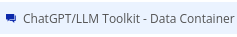
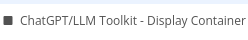

# Visual Elements

## Data Container

This element handles the "Chat Completion w/ Streaming" action, and most of the main events for a streaming chat UI.  Normally you will want to add one or more of these to your page.data_container

## Display Container

This element handles displaying the list of messages in a conversation in a formatted way.  If you have a list of input and output messages (or prompts and responses) you can use this container to display the messages with formatting and styling.  

Note that you *do not need* to use this element to display the messages; you can use a simple repeating group.  But this element tries to help with things like code and markdown formatting, providing an easy "copy" text button, etc.

This element is still in Beta.

## Assistants Container

## Audio Container

