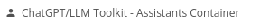

# Visual Elements

## Data Container

This element handles the "Chat Completion w/ Streaming" action, and most of the main events for a streaming chat UI.  Normally you will want to add one or more of these to your page.data_container

## Assistants Container

The Assistant Container enables streaming/real-time interactions with the OpenAI Assistants API.  If you'd like to use "Create Thread and Run (streaming)" or "Create Run (streaming)", you'll need to add one of these to your page.

## Display Container (beta)

This element handles displaying the list of messages in a conversation in a formatted way.  If you have a list of input and output messages (or prompts and responses) you can use this container to display the messages with formatting and styling.  

Note that you *do not need* to use this element to display the messages; you can use a simple repeating group.  But this element tries to help with things like code and markdown formatting, providing an easy "copy" text button, etc.

This element is still in beta.

## Audio Container

This element allows you to do real-time audio streaming (both voice input and AI voice output), using the ChatGPT Audio API.

If you'd like to use these features, you'll need to add an Audio Container to your page.

This element is still in beta.

