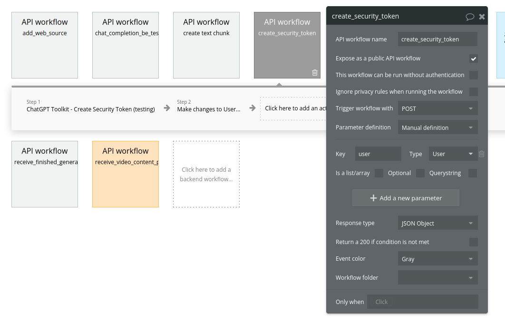
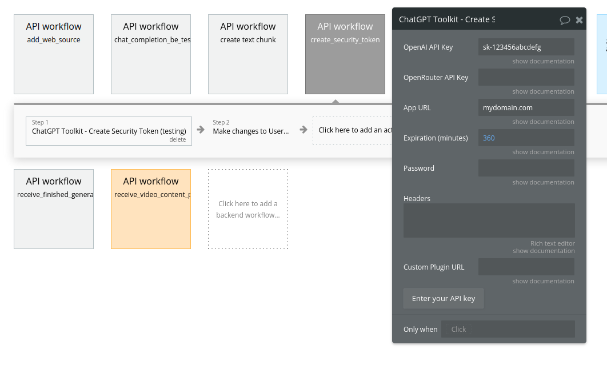
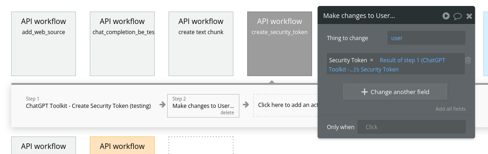
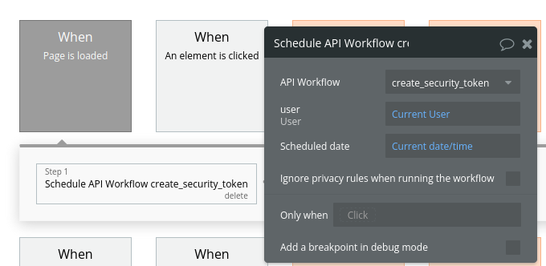

# Usage

This page will cover various usage patterns for the plugin.

## Authentication

### Scenario 1 - You Provide API Key

If using OpenAI or OpenRouter in your app, you'll need to provide an API key to access their APIs.  If you, as the app/platform owner, are using your own API keys to access the services, you will want to protect your keys, so that users cannot see them.  

The "Create Security Token" action allows you encrypt your API keys, so that users cannot see them.  This action returns a "Security Token", with the API key(s) encrypted within them.  You can then pass the Security Token in actions like "Create Chat Completion", rather than passing your API key directly.

When using the Security Token pattern, you *do not* want to include anything in the "User OpenAI API Key" fields of actions.

### Scenario 2 - User Provides API Key

In some cases, your user will provide their own API key (e.g., .for OpenAI).  In these cases, you do not create or provide a Security Token, but pass the user's API key in the field "User OpenAI API Key".

### Best practice - Backend Workflows

The most secure way to create a security token is to use the "Create Security Token" action in a backend workflow.  In this way, your user cannot see the Security Token being created.

We recommend creating a security token on page load, by using the "When page is loaded" trigger, and storing the token on the user.  The steps to do this are:

1. Create a Backend Workflow (BE WF).  This workflow should take a parameter of type "User"; you will pass in the "Current User" to this param.
2. In the BE WF, add a "Create Security Token" action.  Fill in your API key and other details.
3. In the next worfklow step, make changes to the "user" that you passed in, and store the result of the Create Security Token action.
4. On your app page, create a workflow with the "When Page is loaded" trigger.  Run "Schedule API Workflow", calling the "create_security_token" action we created in step 1.  Pass the "Current User" in the user parameter.
5. In actions the user triggers that need a security token (e.g., Chat Completion), you can reference "Current User's Security Token".

{: width="300px" }

### Best practice - Short-lived keys

You can set an expiration time when creating your API keys.  We recommend setting them to a short window.  Short-lived keys reduce the amount of damage an attacker can do in a scenario where they figure out how to extract the security token.

The default expiration is 360 minutes, or 6 hours, but you could set it lower if your app permits.  If your users' sessions are normally an hour or less, we'd recommend setting the Expiration parameter to 60 minutes.

### Best practice - Short-lived Tokens

## Single-message UI

## Multi-turn (conversational UI)

## Audio Apps